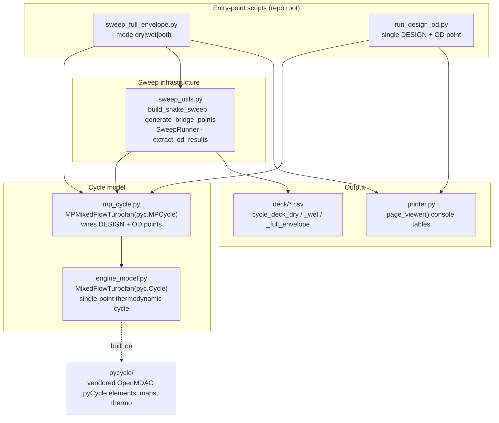

[](https://github.com/Jhawk414/F404-pyCycle/actions)
[](meta/LICENSE.txt)

# F404-pyCycle

A GE F404 twin-spool, low-bypass, mixed-flow, afterburning turbofan **cycle
deck** — design-point sizing plus altitude/Mach/dTs off-design sweeps — built
on [NASA Glenn's pyCycle](https://github.com/OpenMDAO/pyCycle) and
[OpenMDAO](https://openmdao.org/).

Given a thrust target and a handful of component design choices (fan/HPC
pressure ratios, efficiencies, cooling bleed fractions), this repo sizes the
engine at sea-level-static conditions, then sweeps it across altitude,
ambient-temperature offset, and throttle to produce a converged off-design
performance map — the kind of tabular "cycle deck" a preliminary-design or
performance group would hand off to a vehicle-integration team.

**Status:** actively developed. Single-engine model with separate dry (mil
power) and wet (afterburning) DESIGN points; full alt/dTs/throttle sweep
infrastructure in place. See [Current status](#current-status) for
convergence coverage and [Roadmap](#roadmap) for what's next. Not yet
validated against public F404 performance data.

## Table of contents

- [Repo layout](#repo-layout)
- [Architecture and data flow](#architecture-and-data-flow)
- [Installation](#installation)
- [Usage](#usage)
- [Current status](#current-status)
- [Roadmap](#roadmap)
- [Acknowledgments](#acknowledgments)
- [License](#license)

## Repo layout

F404-specific application code currently lives loose at the repo root,
alongside the vendored upstream `pycycle` library it's built on. An open
issue ([#4](https://github.com/Jhawk414/F404-pyCycle/issues/4)) tracks
moving the F404 files below into `src/F404_pycycle/` to separate the two;
paths here reflect the current (pre-restructure) state.

| Path | Role |
|---|---|
| `engine_model.py` | `MixedFlowTurbofan(pyc.Cycle)` — single-point thermodynamic cycle (fan, HPC, burner, HPT/LPT, mixer, afterburner, nozzle) |
| `mp_cycle.py` | `MPMixedFlowTurbofan(pyc.MPCycle)` — wires a DESIGN point and an off-design (OD) point, transferring map scalars and station areas between them |
| `sweep_utils.py` | Sweep infrastructure: snake-pattern sweep grid, bridge-point warm-starting, `SweepRunner`, result extraction |
| `sweep_full_envelope.py` | CLI driver — runs the full alt/dTs/throttle sweep for dry, wet, or both modes |
| `run_design_od.py` | Minimal single DESIGN + one OD point runner, kept as a fast regression check against the pre-refactor model |
| `printer.py` | Console table formatter for DESIGN/OD results |
| `deck/` | Cycle-deck output CSVs |
| `improvements/` | Roadmap notes and planning docs |
| `AGENTS/` | Handoff notes between work sessions |
| `meta/` | Vendored-library provenance (`LICENSE.txt`, upstream `release_notes.md`) |
| `pycycle/`, `setup.py`, `pyproject.toml`, `example_cycles/` | Vendored upstream `pyCycle` library — not F404-specific |

## Architecture and data flow

Current (pre-`src/`-restructure) data flow, from CLI invocation to cycle-deck
CSV. This diagram covers today's module boundaries — expect it to change
once issue #4's restructure lands.



`mp_cycle.py` builds two instances of the same `MixedFlowTurbofan` model —
one with `design=True` (DESIGN point, solved once to size the engine) and
one with `design=False` (the OD point, re-solved at each sweep condition)
— and connects the DESIGN instance's converged map scalars and station
areas into the OD instance so off-design results reflect the sized engine.

## Installation

This repo vendors OpenMDAO's `pyCycle` library directly rather than
installing it from PyPI, so install in editable mode from a local clone:

```bash
git clone git@github.com:Jhawk414/F404-pyCycle.git
cd F404-pyCycle
pip install -e .[all]
```

Requires Python 3.9+ and OpenMDAO 3.10.0+ (pulled in automatically).

## Usage

Run a single DESIGN + off-design point (fast sanity check, a few seconds):

```bash
python run_design_od.py
```

Run the full altitude/dTs/throttle sweep, both dry and wet/AB modes:

```bash
python sweep_full_envelope.py --mode both
```

Use `--mode dry` or `--mode wet` to run just one mode. Results are written
to `cycle_deck_dry.csv`, `cycle_deck_wet.csv`, and (when both modes run)
`cycle_deck_full_envelope.csv` in the current directory — `deck/` is the
proposed durable home for reviewed/accepted deck files (see
[Roadmap](#roadmap)), not yet where the script writes by default.

## Current status

Latest full-envelope sweep (`sweep_full_envelope.py --mode both`) at
alt ∈ {0, 2500, 5000} ft, dTs ∈ {0, ±10, ±20, ±30, ±40, ±50} R, static
(MN ≈ 0.001), 4 throttle levels per mode:

| Mode | Converged | Throttle sweep |
|---|---|---|
| Dry | 125 / 132 | Tt4 3100 → 2500 R |
| Wet | 89 / 132 | Tt7 3800 → 3200 R (Tt4 fixed at 3100 R mil) |

Every point with dTs ≥ 0 R converges. Failures concentrate at cold
(dTs < 0 R) + high-altitude + max-AB corners — tracked in
[issue #3](https://github.com/Jhawk414/F404-pyCycle/issues/3).
