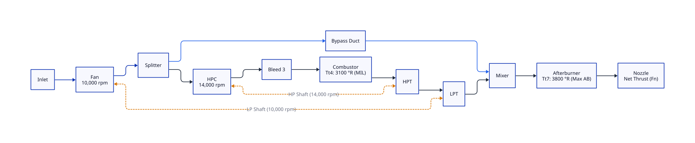
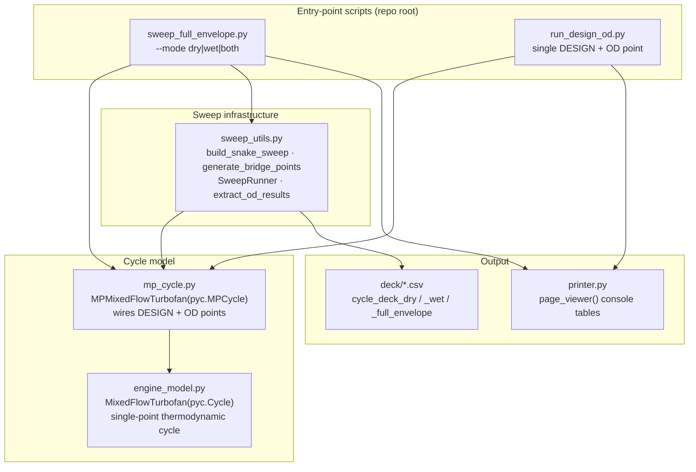

[](https://github.com/Jhawk414/F404-pyCycle/actions)
[](meta/LICENSE.txt)

# F404-pyCycle

A GE F404 twin-spool, low-bypass, mixed-flow, afterburning turbofan cycle model
with design-point sizing and off-design flight sweeps, built on
[NASA Glenn's pyCycle](https://github.com/OpenMDAO/pyCycle) and
[OpenMDAO](https://openmdao.org/).

Given a target thrust and component parameters (fan and HPC pressure ratios,
component efficiencies, cooling bleed fractions), the model sizes the engine
at sea-level-static conditions and sweeps altitude, ambient temperature offset,
and throttle to generate a converged off-design performance deck.

**Status:** In development. Single-engine model with separate dry (military
power) and wet (afterburning) design points and altitude/dTs/throttle sweep
infrastructure. See [Current status](#current-status) for convergence coverage
and [Roadmap](#roadmap) for planned work. Not yet validated against public
F404 performance data.

## Table of contents

- [Repo layout](#repo-layout)
- [Cycle architecture](#cycle-architecture)
- [Software architecture and data flow](#software-architecture-and-data-flow)
- [Installation](#installation)
- [Usage](#usage)
- [Current status](#current-status)
- [Roadmap](#roadmap)
- [Acknowledgments](#acknowledgments)
- [License](#license)

## Repo layout

F404 model code currently resides at the repository root alongside the vendored
upstream `pycycle` library. Issue [#4](https://github.com/Jhawk414/F404-pyCycle/issues/4)
tracks moving the F404 files into `src/F404_pycycle/`. Paths below reflect the
current layout.

| Path | Role |
|---|---|
| `engine_model.py` | `MixedFlowTurbofan(pyc.Cycle)`: single-point thermodynamic cycle (fan, HPC, burner, HPT/LPT, mixer, afterburner, nozzle) |
| `mp_cycle.py` | `MPMixedFlowTurbofan(pyc.MPCycle)`: links a DESIGN point and an off-design (OD) point, transferring map scalars and station areas |
| `sweep_utils.py` | Sweep infrastructure: snake-pattern sweep grid, bridge-point warm-starting, `SweepRunner`, result extraction |
| `sweep_full_envelope.py` | CLI driver: runs the alt/dTs/throttle sweep for dry, wet, or both modes |
| `run_design_od.py` | Single DESIGN and OD point runner for regression checking |
| `printer.py` | Console table formatter for DESIGN/OD results |
| `deck/` | Cycle-deck output CSVs |
| `docs/` | System architecture diagrams (`f404_cycle.d2`, `f404_cycle.svg`) and planning docs |
| `AGENTS/` | Session handoff notes |
| `meta/` | Vendored-library provenance (`LICENSE.txt`, upstream `release_notes.md`) |
| `pycycle/`, `setup.py`, `pyproject.toml`, `example_cycles/` | Vendored upstream `pyCycle` library |

## Cycle architecture

The thermodynamic cycle model in `engine_model.py` (`MixedFlowTurbofan`) represents the twin-spool, mixed-flow, augmented F404 turbofan engine:



*Diagram source maintained in [`docs/f404_cycle.d2`](docs/f404_cycle.d2).*

Key cycle components and mechanical couplings:
- **Low Pressure (LP) Spool**: 3-stage fan driven by the single-stage LP turbine via `lp_shaft` (10,000 rpm).
- **High Pressure (HP) Spool**: 7-stage HP compressor driven by the single-stage HP turbine via `hp_shaft` (14,000 rpm, 250 hp customer power extraction).
- **Cooling Bleeds**: HPC interstage bleed (`cool1`, 5.07% flow) cools the LPT; compressor discharge bleed (`cool3`, 11.0% flow) cools the HPT.
- **Mixed Exhaust & Augmentor**: Core flow and bypass flow mix in a confluent mixer, feed into the afterburner duct (active combustor in wet mode, pass-through in dry mode), and expand through a variable convergent-divergent nozzle (`mixed_nozz`).

## Software architecture and data flow

Current data flow from CLI invocation to output CSV. This diagram reflects
module boundaries before the planned restructure in issue #4.



`mp_cycle.py` instantiates `MixedFlowTurbofan` twice: once with `design=True`
(DESIGN point, solved once to size the engine) and once with `design=False`
(OD point, re-solved at each sweep condition). It passes converged map scalars
and station areas from the DESIGN instance into the OD instance so off-design
calculations use the sized engine geometry.

## Installation

This repository vendors OpenMDAO's `pyCycle` library. Install in editable mode
from a local clone:

```bash
git clone git@github.com:Jhawk414/F404-pyCycle.git
cd F404-pyCycle
pip install -e .[all]
```

Requires Python 3.9+ and OpenMDAO 3.10.0+.

## Usage

Run a single DESIGN and off-design point for verification:

```bash
python run_design_od.py
```

Run the altitude/dTs/throttle sweep for dry and wet modes:

```bash
python sweep_full_envelope.py --mode both
```

Use `--mode dry` or `--mode wet` to run an individual mode. Output files
(`cycle_deck_dry.csv`, `cycle_deck_wet.csv`, or `cycle_deck_full_envelope.csv`)
are written to the working directory. Moving output generation to `deck/` is
tracked in [Roadmap](#roadmap).

## Current status

Latest full-envelope sweep (`sweep_full_envelope.py --mode both`) at
alt ∈ {0, 2500, 5000} ft, dTs ∈ {0, ±10, ±20, ±30, ±40, ±50} R, static
(MN ≈ 0.001), 4 throttle levels per mode:

| Mode | Converged | Throttle sweep |
|---|---|---|
| Dry | 125 / 132 | Tt4 3100 → 2500 R |
| Wet | 89 / 132 | Tt7 3800 → 3200 R (Tt4 fixed at 3100 R MIL) |

All points with dTs ≥ 0 R converge. Solver failures concentrate at cold
(dTs < 0 R), high-altitude, maximum afterburning conditions, tracked in
[issue #3](https://github.com/Jhawk414/F404-pyCycle/issues/3).

## Roadmap

Done:

- [x] Modular cycle model (`engine_model.py` / `mp_cycle.py`), refactored off
      the original monolithic `MFTF_od_CRZ.py`
- [x] Full alt/dTs/throttle sweep infrastructure with bridge-point
      warm-starting (`sweep_utils.py`)
- [x] Dry (MIL) / wet (max-AB) mode split, with convergence-detection bugs
      fixed (bound-saturated states no longer reported as converged)

Planned (see `docs/improvements/IMPROVEMENTS.md` for full detail):

- [ ] `src/` restructure: separate F404 app code from vendored pyCycle
      library ([#4](https://github.com/Jhawk414/F404-pyCycle/issues/4))
- [ ] Single-engine sizing: unify dry and wet DESIGN points
      ([#2](https://github.com/Jhawk414/F404-pyCycle/issues/2))
- [ ] Resolve remaining cold/high-alt/max-AB Newton convergence failures
      ([#3](https://github.com/Jhawk414/F404-pyCycle/issues/3))
- [ ] Per-module test suite convention (`<module>_test.py`)
      ([#5](https://github.com/Jhawk414/F404-pyCycle/issues/5))
- [ ] Sync vendored `pycycle/` against upstream
      ([#6](https://github.com/Jhawk414/F404-pyCycle/issues/6))
- [ ] `deck/` as a durable, reviewed home for cycle-deck CSVs + solver logs
- [ ] YAML-driven run configuration (`run.yml`) with pydantic validation
- [ ] CLI entry point (`design` / `sweep` / `init-config` subcommands)
- [ ] Auto-generated sweep-envelope coverage plot

## Acknowledgments

This repo is a fork of NASA Glenn's
[pyCycle](https://github.com/OpenMDAO/pyCycle) (`om-pycycle` on PyPI),
built on the [OpenMDAO](https://openmdao.org/) framework. The `pycycle/`
library code, `setup.py`, and `example_cycles/` are vendored upstream
scaffolding, not F404-specific.

If you use pyCycle itself, please cite:

> E. S. Hendricks and J. S. Gray, "pyCycle: A Tool for Efficient
> Optimization of Gas Turbine Engine Cycles," *Aerospace*, vol. 6, iss. 87,
> 2019. doi:10.3390/aerospace6080087

## License

Apache License 2.0. See [`meta/LICENSE.txt`](meta/LICENSE.txt).
